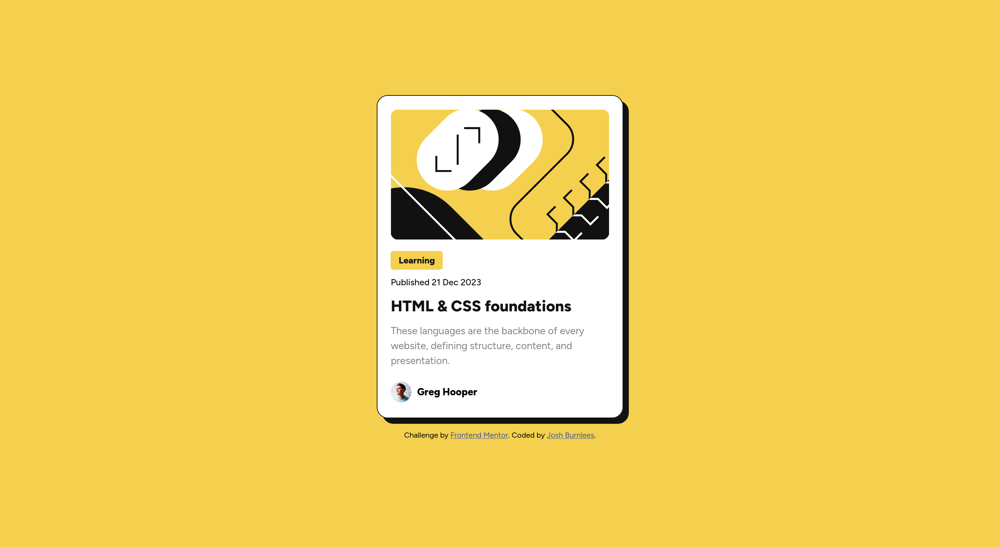

# Frontend Mentor - Blog preview card solution

This is a solution to the [Blog preview card challenge on Frontend Mentor](https://www.frontendmentor.io/challenges/blog-preview-card-ckPaj01IcS). Frontend Mentor challenges help you improve your coding skills by building realistic projects. 

## Table of contents

- [Overview](#overview)
  - [The challenge](#the-challenge)
  - [Screenshot](#screenshot)
  - [Links](#links)
- [My process](#my-process)
  - [Built with](#built-with)
  - [What I learned](#what-i-learned)
  - [Continued development](#continued-development)
  - [Useful resources](#useful-resources)
- [Author](#author)

## Overview

### The challenge

Users should be able to:

- See hover and focus states for all interactive elements on the page

### Screenshot

### Links

- Live Site URL: [https://burnlees.github.io/blog-preview-card/](https://burnlees.github.io/blog-preview-card/)

## My process

### Built with

- Semantic HTML5 markup
- CSS custom properties
- Flexbox

### What I learned

I learned more about utilising solely flex, rather than Grid like the previous challenged. I was struggling at first to get the card aligned correctly, until I realised I needed to set a height for the parent container. 

### Continued development

Going foward I would like to refine my skills with CSS over all, particularly by trying to challenge myself with more advanced layouts and designs. Get better at matching sizings of designs. 

### Useful resources

- [Flexbox or Grid challenge // which would you use to solve these?](https://youtu.be/aKFB5Bjk6KM?si=x37MnxKjDeTMmlCu) - Good video from Kevin Powell which helped me understand when to use Flexbox or Grid

## Author

- Frontend Mentor - [@Burnlees](https://www.frontendmentor.io/profile/burnlees)
